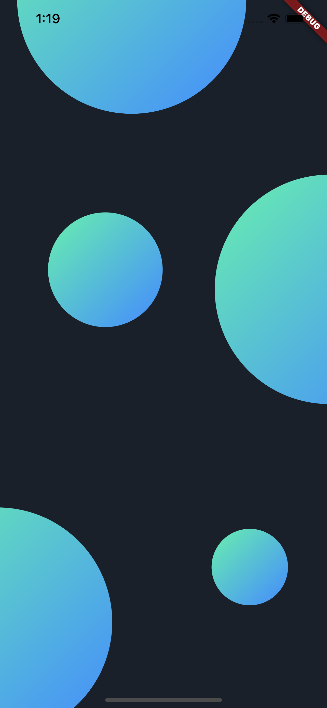

# Animation Wait Refernice

|실행 이미지 |화면영상|
|:--:|:--:|
| | |

> Init Code

```dart
  // Init 
   controller1 =
        AnimationController(vsync: this, duration: const Duration(seconds: 5));
    animation1 = Tween<double>(begin: .1, end: .15)
        .animate(CurvedAnimation(parent: controller1, curve: Curves.easeInOut))
      ..addListener(() {
        setState(() {});
      })
      ..addStatusListener((status) {
        if (status == AnimationStatus.completed) {
          controller1.reverse();
        } else if (status == AnimationStatus.dismissed) {
          controller1.forward();
        }
      });

    animation2 = Tween<double>(begin: .2, end: .4)
        .animate(CurvedAnimation(parent: controller1, curve: Curves.easeInOut))
      ..addListener(() {
        setState(() {});
      })
      ..addStatusListener((status) {
        if (status == AnimationStatus.completed) {
          controller1.reverse();
        } else if (status == AnimationStatus.dismissed) {
          controller1.forward();
        }
      });
      


```

> Use Code

``` dart

// Use
  Positioned(
    top: size.height * (animation2.value + 0.4),
    left: size.width * (animation2.value + 0.3),
    child: Container(
      ecoration: BoxDecoration(
      borderRadius: BorderRadius.circular(50),
      gradient: LinearGradient(
        colors: [Colors.greenAccent, Colors.blueAccent],
        begin: Alignment.topLeft,
        end: Alignment.bottomRight),
        ),
      width: 100,
      height: 100,
    ),
  ),
```
